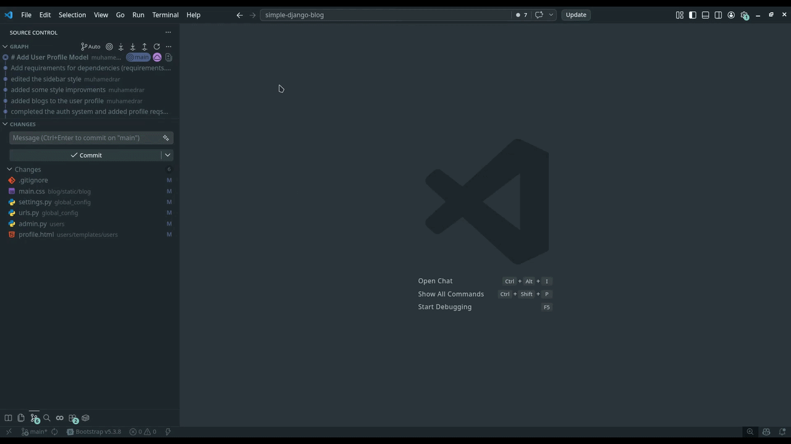

# KodeCommit

<p align="center">
  
  
  
  
  
  
</p>

<p align="center">
  
</p>

KodeCommit is a VS Code extension that generates Git commit messages from the Source Control view. KODE stands for Keep Our Diffs Explained.

The current build ships with an OpenAI provider, plus a configurable base URL so you can also point it at OpenAI-compatible endpoints such as Cohere.

## Features

- Adds a `Generate Commit Message` button to the Source Control title bar
- Adds an `AI Settings` button to the Source Control title bar
- Generates a commit message from the current Git diff
- Reads the staged diff first, then falls back to the unstaged diff
- Stores API keys in VS Code Secret Storage
- Supports `OPENAI_API_KEY` as a fallback source for the API key
- Lets you choose a model from the provider's model list
- Lets you enter a model manually if model listing is unavailable
- Lets you change the base URL from the settings menu
- Keeps a provider switcher in place for future expansion
- Lets you edit the commit instructions template from inside VS Code
- Uses a disk-based template with `[SYSTEM]` and `[USER]` sections
- Falls back to built-in default instructions if the template is missing or malformed
- Normalizes the AI response before inserting it
- Fills the SCM commit input box automatically when possible
- Falls back to opening a `git-commit` document if SCM insertion is unavailable

## Quick Start

### Cohere quick start

Cohere is a good starter option to try first. As of April 25, 2026, Cohere documents free trial or evaluation API keys for new accounts, with rate limits, so it can be an easy way to test KodeCommit before moving to a paid production key.

1. Create a Cohere account and get a trial API key.
2. Open a Git repository in VS Code.
3. Open the Source Control view.
4. Click `AI Settings`.
5. Keep the provider set to `OpenAI`.
6. Choose `Set API key for OpenAI` and paste your Cohere key.
7. Choose `Set base URL for OpenAI` and set it to `https://api.cohere.com/compatibility/v1`.
8. Choose `Choose model for OpenAI` or `Enter model manually for OpenAI`.
9. Close the settings menu.
10. Click `Generate Commit Message`.

Cohere compatibility base URL:

```text
https://api.cohere.com/compatibility/v1
```

Starter note:

- Cohere says trial or evaluation keys are free for getting started
- As of April 25, 2026, Cohere documents trial limits such as 1,000 API calls per month and 20 chat requests per minute
- If model listing does not work for your account, enter the model manually

### OpenAI quick start

1. Open a Git repository in VS Code.
2. Open the Source Control view.
3. Click `AI Settings`.
4. Keep the provider set to `OpenAI`.
5. Choose `Set API key for OpenAI` and paste your OpenAI key.
6. Choose `Set base URL for OpenAI` and keep `https://api.openai.com/v1`.
7. Choose `Choose model for OpenAI` or `Enter model manually for OpenAI`.
8. Close the settings menu.
9. Click `Generate Commit Message`.

OpenAI base URL:

```text
https://api.openai.com/v1
```

## Other Provider URLs

KodeCommit currently exposes `OpenAI` as the built-in provider in the UI, but you can change its base URL to another OpenAI-compatible endpoint from `AI Settings`.

Common provider URLs:

| Provider | Base URL |
| --- | --- |
| Cohere | `https://api.cohere.com/compatibility/v1` |
| OpenAI | `https://api.openai.com/v1` |
| Ollama (local) | `http://localhost:11434/v1` |
| Kimi (Moonshot) | `https://api.moonshot.cn/v1` |
| Claude (Anthropic) | `https://api.anthropic.com/v1` |

To try another provider:

1. Open `AI Settings`.
2. Leave the active provider as `OpenAI`.
3. Set the provider's API key.
4. Set the base URL to the endpoint you want to use.
5. Choose a model from the list, or enter one manually.
6. Generate the commit message.

Compatibility note:

- KodeCommit sends OpenAI-style requests to `/models` and `/chat/completions`.
- Cohere is a practical starter choice because it offers free trial or evaluation usage for testing, but those keys are limited.
- Providers with an OpenAI-compatible API usually work best.
- If model listing fails, use `Enter model manually`.
- The current OpenAI provider flow expects the API key field to be filled. For local endpoints that ignore auth, a placeholder value may still be required.
- Some providers may require a compatibility layer or different auth behavior even if they expose a similar `/v1` URL.

## Settings Menu

The `AI Settings` menu stays open until you close it, so you can configure everything in one pass.

Available actions:

- Switch the active provider
- Choose a model from the provider
- Enter a model manually
- Edit the commit instructions template
- Set the API key
- Clear the stored API key
- Set the base URL
- Close settings

## Commit Instructions Template

The prompt template lives here:

- [`templates/commit-template.txt`](templates/commit-template.txt)

It supports two sections:

```text
[SYSTEM]
...
[/SYSTEM]

[USER]
...
{{diff}}
[/USER]
```

`{{diff}}` is replaced with the current Git diff before the request is sent.

If the template is missing or malformed, KodeCommit falls back to a built-in default template.

## Tip for Small Models

Smaller models usually perform better when the instructions are shorter, stricter, and leave less room for interpretation. If you're using a small model, keep the rules narrow and ask for a very short response to reduce hallucination.

Good small-model guidance:

- Ask for exactly one line
- Require a fixed format like `type: short message`
- Limit the length
- Forbid explanations, bullets, quotes, and extra text

Example instructions:

```text
[SYSTEM]
You write Git commit subjects only.
Return exactly one line.
Use this format: type: short message
Keep it under 60 characters.
Do not add quotes, bullets, code fences, or explanations.
If unsure, choose the safest accurate conventional type.
[/SYSTEM]

[USER]
Write one commit subject for this diff.
Output one line only.

Diff:
{{diff}}
[/USER]
```

## How It Works

1. KodeCommit finds the active Git repository.
2. It reads the staged diff first.
3. If nothing is staged, it reads the unstaged diff.
4. It builds a request from the template file.
5. It sends the request to the configured endpoint.
6. It cleans up the returned text.
7. It inserts the message into the SCM input box when possible.
8. If that is not possible, it opens a `git-commit` document instead.

## Installation

1. Clone or open this project in VS Code.
2. Package it if needed:

```bash
npm run package-vsix
```

3. Install the generated VSIX in VS Code, or run the extension in Extension Development Host mode.

## Requirements

- VS Code `^1.80.0`
- A Git repository open in the workspace
- A valid model configured for the selected endpoint
- An API key for providers that require one

## Architecture

- Provider definitions: `src/providers`
- Provider state and secret handling: `src/state.js`
- Command and settings flow: `src/commands.js`
- Commit prompt building and output cleanup: `src/commit.js`
- Git diff lookup: `src/git.js`
- Prompt template: `templates/commit-template.txt`

## Contributing

Contributions are welcome. Feel free to open an issue, suggest an improvement, or submit a pull request.

Good first contributions:

- Improve the prompt template or documentation
- Add support for more OpenAI-compatible providers
- Improve the settings flow or error messages
- Help test the extension with different models and endpoints

If you want to contribute, please keep changes focused and easy to review.

## Support

If you run into a bug or have an idea for the project, open an issue and include the provider, model, base URL, and a short description of what happened.

## Troubleshooting

### No models are listed

- Check that the base URL is correct.
- Check that the API key is valid.
- Some endpoints do not expose model lists in the same format.
- Use `Enter model manually` if needed.

### The commit message was not inserted into Source Control

KodeCommit first tries to write to the built-in Git SCM input box. If that is not available, it opens a `git-commit` document instead.

### The output is too verbose or inconsistent

- Tighten the prompt in [`templates/commit-template.txt`](templates/commit-template.txt)
- Use stricter instructions for smaller models
- Ask for one line only and a shorter response
